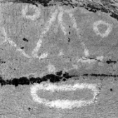
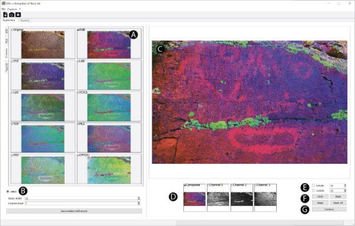
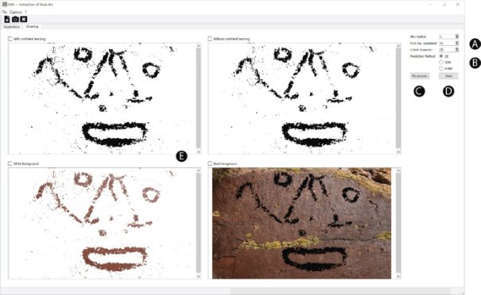

**Welcome to ERA!**

Version 1.0

**Presentation**. The aim of the ERA software is to help the researcher to identify rock paintings from digital images, quickly producing high-quality documentation, very simply. The three RGB colour channels of the digital image are first decorrelated and then stretched, a well-known technique used by remote sensing specialists for over thirty years. Unlike approaches previously developed specifically for rock art, several methods for data whitening are used at this step: ‘normal’ principal component analysis, zero-phase component analysis, Cholesky decomposition, and independent component analysis. These transformations produce different arrangements of colour information. The decorrelated data, stretched and scaled to fit the RGB space, are then converted into various colour spaces, selected among the most widely used: XYZ, HLS, HSV, LAB (CIELAB), Luv, CMY(K), YCrCb, YUV. The most subtle colour variations are better perceived in the new, contrasted, false-coloured images obtained from some of the resulting combinations. The researcher can then take advantage of supervised machine learning algorithms to isolate painted figures. At this step, binary pixel classification is performed either by logistic regression, support vector machine, or *k*-nearest neighbours, possibly also including confident learning. There is no need for complex tuning during the procedure, which lasts a few minutes at most, while *a posteriori* cleaning of the produced document should be minimal. The software, written in Python, is provided as a stand-alone executable program for Windows for broader diffusion, and as open-source code, capable of evolving to fit the needs of the community.

**Installation**. 

*Windows*. Copy the ERA\_Windows folder into the directory of your choice. To run the software, double-click on ERA.exe, in the ERA\_Windows folder. Even if the program is relatively simple, this does not mean that it is small, as it contains several dependencies. As a result, the ERA\_Windows folder is quite heavy. With Avast, you may experience some difficulties in runnig ERA because it erroneously detects a Trojan-Gen virus. In this case, stop Avast while running ERA.

*Python*. Copy the ERA\_Python folder into the directory of your choice. Use main.py to run the software with a Python interpreter. Install the dependencies listed in `requirements.txt` (`pip install -r requirements.txt`). One Qt binding is required: PyQt6, PyQt5 or PySide2 (the local `qt` shim tries them in that order). The stabilized code is tested with modern versions: Python 3.10, numpy 2.2, OpenCV 5.0, scipy 1.15, scikit-learn 1.7, scikit-image 0.25, cleanlab 2.9, qimage2ndarray 1.10, QtPy 2.4. For Linux distribution, an AppImage, containing code and dependencies is provided. It can be run without superuser permissions to launch the application.

*Building executables*. The repository ships a `ERA.spec` file for PyInstaller (one-folder bundle). From an environment with the dependencies installed (e.g. `era2`), run:

```
pyinstaller ERA.spec --noconfirm
```

The result lands in `dist/ERA/` (`ERA.exe` on Windows, `ERA.app` on macOS). Builds are native: build on each target platform/architecture, there is no cross-compilation. On Windows the `icone_ERA.ico` icon is used automatically; on macOS an `icone_ERA.icns` file must be provided at the project root for the bundle icon (the build works without it, just without a custom icon).

The folder Images\_test contains the images presented as examples in the accompanying manuscript. 

**Opening a new image**. Images in PNG, JPG, BMP, and TIF formats are accepted by ERA. Note that capture made in RAW format, and then saved in TIF *via* proprietary software provided by the camera company, or a commercial software program (such as ADOBE Lightroom or ADOBE Photoshop), is often the best choice. For JPEG capture, always prefer the highest possible quality. Simply open the file of interest from File -> Open, or use the appropriate shortcut icon. 

**Supervision panel**

**Image preparation and navigation among thumbnails**. The image is preprocessed using the four whitening procedures (ZCA, PCA, Cholesky, FastICA), and then transformed into other colour spaces (XYZ, Lab, Luv, YCrCb, YUV, HLS, HSV, CMY(K)). This operation takes a few seconds, depending on the size of the image, and on the computational power available. Note that a progression bar located at the bottom right of the program window indicates how quickly the work is advancing. Once the calculations have been performed, the combinations between the whitening procedure and the colour spaces used can be seen in the left part of the program window (A, Fig. 1). The operator can easily move from one whitening procedure to another by clicking on the corresponding tab. Clicking on the thumbnails will enlarge images in the main window (C, Fig. 1). Below the main window, four thumbnails represent the composite image, and each of its three channels (D, Fig. 1), which can be selected to be enlarged in the main window. Interestingly, snapshots of the main window can be taken at any time using Capture -> Snapshot (or F1) or clicking on the appropriate icon.



**Figure 1:** Screenshot of the ERA software (Supervision tab). A: Combinations between whitening procedures and colour spaces; B: Colour enhancement panel; C: Main window; D: Thumbnails of the composite image and the three channels; E: Supervision panel; F: Correction panel; G: Continue button to move to the next step once supervision has been completed. 

**Optional colour enhancement.** Two procedures are available to enhance colour richness (B, Fig. 1). The first (enabled by default) involves manual selection of specific areas, from which parameters for whitening transforms are extracted, and then applied to the entire image. Stroke width of the pen (10 px by default) is configurable. Once the appropriate selection has been made (producing yellow curves in the image), results are obtained by pressing the Decorrelation Refinement button. Another option consists in applying linear stretching with saturation, with a strength governed by the Contrast Boost value. By default, contrast boost equals 1, meaning that stretch is operated on each channel, between the 0.5th – 99.5th percentiles. Here also, results are obtained by pressing the Decorrelation Refinement button. Note that both enhancement procedures can be combined.

**Supervision.** This step consists in tracing curves in the image, to train the software with two sets of pixels, corresponding respectively to paintings (toggle include, and then paint in black) and substate (toggle exclude, and then paint in red) (E, Fig. 1). Pen widths (in pixels) are adjustable (default 10 px) when labelling the two classes (E, Fig. 1). At this step, the operator needs to adapt the size of the pen to minimize erroneous labelling as much as possible. Undo and Redo buttons are available; they concern only the last action. The Reset button cleans all actions made on the selected class (F. Fig. 1). Note that Undo, Redo, and Reset also apply to the colour enhancement made by selection (see above). Reset All removes everything, including supervision and any selection for optional colour enhancement. Once the supervision has appropriately covered instances in both groups to be as representative as possible, push the Continue button to run model training (G., Fig. 1).



**Figure 2:** Screenshot of the ERA software (Drawing tab). A: Tuning; B: Machine learning algorithm selection; C: Re-process button (after changes on A or B); D: Save button; E: Outputs and corresponding checkboxes for saving.

**Drawing panel**

**Machine learning**. The operator is then transferred to the Drawing tab (Fig. 2). By default, a logistic regression (LR) is used as classifier. It should provide good results very quickly. After visual examination of the outputs, some adjustments may nevertheless be necessary. Blur radius in pixels, level of PCA var. explained, and the *n* best channels retained for calculation can be modified (A, Fig. 2; see also the accompanying paper for their meaning and influence). After tuning modifications, a new computation must be performed by pressing the Re-process button (C, Fig. 2). Another useful possibility is to modify or supplement supervision. In this case, just click on the Supervision tab, then modify the labelling following your needs, and push the Continue button to return to the Drawing tab. The last possibility consists in selecting another classifier (B, Fig. 2). Two other machine learning algorithms are available: Support vector machine (SVM), and k-nearest neighbours (K-NN). The SVM often provides better results, but at the expense of time; patience may be required. 

**Saving outputs**. Four outputs are available: painted areas in black, with or without confident learning (see manuscript for details), or in their true colour without the background, and in black over the original colour image. Use the checkboxes to select the output desired (E, Fig. 2), and push the Save button on the right of the window (D, Fig. 2). Images are saved in uncompressed TIF format. Interestingly, outputs in black and white (i.e. the two uppermost drawings in the main window) are also systematically saved in SVG format to help scientists in the case of post-processing with a vector graphics editor.

**Programming**

ERA was written in Python 3.7, using the numpy, scipy, scikit-learn, qimage2ndarray, OpenCV, and PyQt5 (or PySide) libraries. The software is freely available, without any warranty about the relevance of the results produced.


