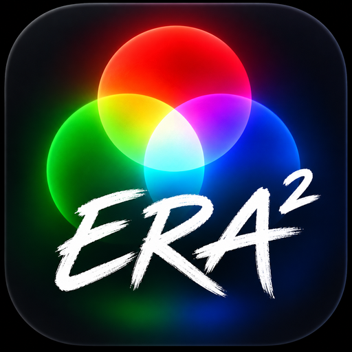
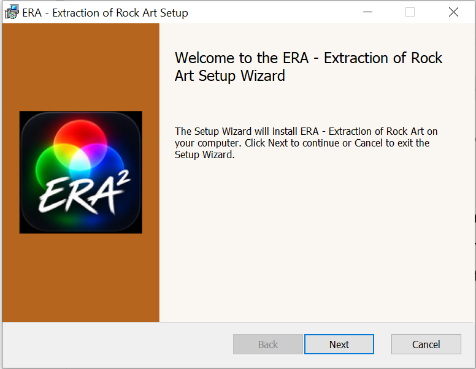
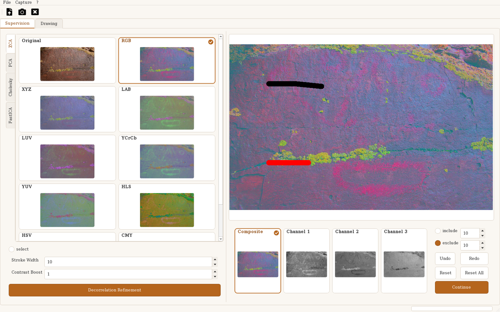
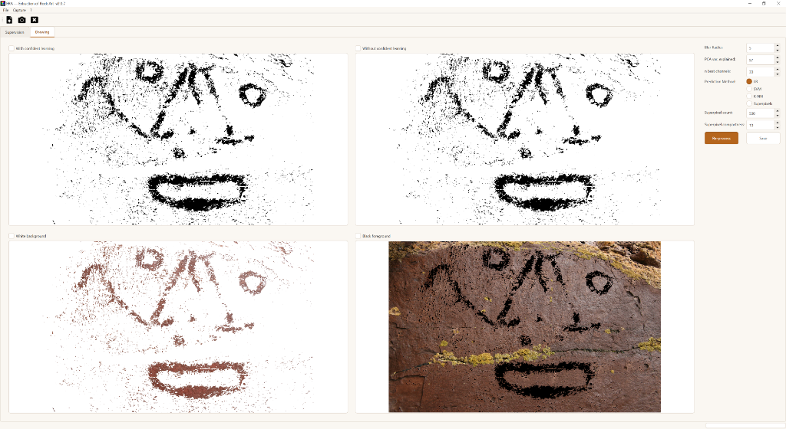

<p align="center">
  
</p>

<h1 align="center">ERA2 — Extraction of Rock Art</h1>

<p align="center">
  Decorrelation stretch and supervised classification of rock paintings from digital images.<br>
  <a href="https://github.com/Fabri-Momo/ERA2/releases/latest"><b>Download the latest release</b></a> ·
  <a href="https://github.com/Fabri-Momo/ERA2/actions/workflows/build.yml">Build status</a>
</p>

ERA2 is the successor of [ERA 1.0](https://gitlab.huma-num.fr/fmonna/era-extraction-from-rock-art) (2022), which is kept unchanged as it corresponds to the published article:

> Monna, F.; Rolland, T.; Magail, J.; Esin, Y.; Bohard, B.; Allard, A.-C.; Wilczek, J.; Chateau-Smith, C. (2022). *ERA: A new, fast, machine learning-based software to document rock paintings.* Journal of Cultural Heritage, 58, 91–101. https://doi.org/10.1016/j.culher.2022.09.018

The source code is hosted on GitHub (https://github.com/Fabri-Momo/ERA2) and mirrored on the Huma-Num GitLab (https://gitlab.huma-num.fr/fmonna/era2).

---

## >>> DOWNLOADS <<<

**All installers are published on GitHub Releases:**

### https://github.com/Fabri-Momo/ERA2/releases/latest

| Platform | File | Installation |
|---|---|---|
| Windows 10/11 x64 | `ERA-<version>-windows-x64.msi` | Run the installer; ERA appears in the Start menu |
| macOS (Apple Silicon) | `ERA-<version>-macos-arm64.zip` | Unzip, drag `ERA.app` to Applications |
| macOS (Intel) | `ERA-<version>-macos-x86_64.zip` | Unzip, drag `ERA.app` to Applications |

Nothing else is required: no Python installation. See [Installation](#installation) for the SmartScreen / Gatekeeper notes.

---

## What is new since ERA 1.0

### Installation and platforms

- **Windows MSI installer** replaces the `ERA_Windows` folder to unpack by hand: installs into `Program Files\ERA`, creates Start-menu and desktop shortcuts, appears in *Apps & Features*, upgrades in place and uninstalls cleanly.
- **macOS applications** for Apple Silicon and Intel (`ERA.app`). ERA 1.0 was Windows-only (plus a Linux AppImage).
- Runs from source on Windows, macOS and Linux with a modern stack (Python 3.10, PyQt6, numpy 2, OpenCV 5, scikit-learn 1.7, cleanlab 2.9); ERA 1.0 required Python 3.7 and cleanlab 0.1.1.
- New ERA² icon and an ochre theme; the interface is English only, whatever the system language.
- Every push is tested and packaged by continuous integration; releases are built automatically from a version tag.

### Speed and reproducibility

- **Up to 40× faster** (see the table below); K-NN, previously almost unusable on large photographs, now runs in seconds.
- **Reproducible results**: the same image and the same strokes always give exactly the same drawing, run after run (the confident-learning step was previously unseeded).
- Large images are processed in bounded memory chunks, with a small cache for the 36 false-colour views instead of keeping them all in RAM.

### Image processing

- **Native bit depth**: 8- and 16-bit images are processed as floating-point data without early quantisation; alpha channels mark invalid pixels. 8-bit conversion only happens for display and export.
- Whitening transforms are numerically identical to ERA 1.0 (verified by a compatibility test suite against the 2020 outputs), with deterministic component ordering and signs so that Windows and macOS give the same images.
- Robustness: degenerate selections (too small, uniform colour) are reported instead of crashing; contrast stretch handles constant channels.

### New tools

- **Superpixels** classification method: SLIC segmentation followed by a random forest on superpixel colour statistics, with *Superpixel count* and *compactness* parameters.
- **Version** shown in the title bar and the **? → About** box; per-user log file for diagnostics (`%LOCALAPPDATA%\ERA\era.log` on Windows, `~/Library/Logs/ERA/era.log` on macOS).
- Interface hardening: controls are disabled during background computations, keyboard **U** / **R** undo / redo, no crashes when drawing before an image is loaded.

### Unchanged

- The whitening algorithms (ZCA, PCA, Cholesky, FastICA), the eight colour spaces, the contrast stretch, the *n*-best channel selection and the LR / SVM / K-NN classifiers with and without confident learning follow the 2022 article; results are identical to ERA 1.0.

---

## What ERA does

ERA helps researchers identify rock paintings and produce high-quality documentation in a few minutes, with no complex tuning.

1. **Decorrelation.** The three RGB channels are whitened with four different methods — zero-phase component analysis (**ZCA**), principal component analysis (**PCA**), **Cholesky** decomposition and independent component analysis (**FastICA**) — then contrast-stretched. Each transform produces a different arrangement of the colour information.
2. **Colour spaces.** Every whitened image is converted into eight colour spaces (XYZ, LAB, LUV, YCrCb, YUV, HLS, HSV, CMY), giving 36 false-colour views in which subtle pigment traces become visible.
3. **Supervised classification.** Paint a few strokes over the figure (*include*) and over the rock (*exclude*); ERA trains a pixel classifier — logistic regression, SVM, *k*-nearest neighbours or superpixel random forest — with and without [confident learning](https://github.com/cleanlab/cleanlab) to correct labelling noise.
4. **Outputs.** Binary drawings (also exported as **SVG** for vector post-processing), the figure in true colour on a white background, and the figure in black over the original photograph.

The whole pipeline works on the image at its native bit depth (8- or 16-bit, alpha-aware); 8-bit quantisation only happens for display and export.

### Much faster than ERA 1

ERA 2 produces exactly the same transforms as the original 2020 implementation (verified by the compatibility test suite) but is considerably faster. On a 2000 × 1260 photograph and a 16-core PC:

| Step | ERA 1 | ERA 2 |
|---|---:|---:|
| Opening an image (four whitening transforms) | 15 s | **2 s** |
| Decorrelation refinement | 2.5 s | **1 s** |
| Classification — LR / SVM / Superpixels | 9 – 12 s | **5 – 8 s** |
| Classification — K-NN | 290 s | **7 s** |

The K-NN prediction now runs a multi-threaded nearest-neighbour query (same neighbours, same vote, identical result), redundant validation passes over the full image were removed, and the confident-learning step no longer spawns worker processes. Results are also fully reproducible: the same image and strokes always give the same drawing, run after run.

## Installation

Pre-built packages are published for every release on the [Releases page](https://github.com/Fabri-Momo/ERA2/releases/latest).

| Platform | File | Notes |
|---|---|---|
| **Windows 10/11 (x64)** | `ERA-<version>-windows-x64.msi` | Standard installer: Start-menu and desktop shortcuts, entry in *Apps & Features*, in-place upgrades. Windows SmartScreen may warn about an unknown publisher (the package is not code-signed): choose *More info → Run anyway*. |
| **macOS (Apple Silicon)** | `ERA-<version>-macos-arm64.zip` | Unzip and drag `ERA.app` to *Applications*. |
| **macOS (Intel)** | `ERA-<version>-macos-x86_64.zip` | Same as above, for Intel Macs. |

The macOS apps are not notarised. On first launch macOS will refuse to open them; either right-click `ERA.app` → *Open*, or run once in Terminal:

```
xattr -cr /Applications/ERA.app
```

<p align="center"></p>

### Running from source

```
git clone https://github.com/Fabri-Momo/ERA2.git
cd ERA2
conda create -n era2 python=3.10
conda activate era2
pip install -r requirements.txt
python main.py
```

`requirements.txt` pins the exact versions the release is built and tested with (numpy 2.2, OpenCV 5.0, scipy 1.15, scikit-learn 1.7, scikit-image 0.25, cleanlab 2.9, PyQt6 6.8). The `qt/` shim also accepts PyQt5 or PySide2 (`QT_API=pyqt5`). Linux is supported from source with the same commands.

## Using ERA

### Opening an image

PNG, JPG, BMP and TIF (8- or 16-bit) are accepted. RAW captures developed to TIF are usually the best input; for JPEG, use the highest quality. Open the file with **File → Open** (Ctrl+O) or the toolbar icon. The four whitening transforms run in the background; a progress bar at the bottom right shows the advancement.

### Supervision tab



- **Left panel** — one tab per whitening method (ZCA, PCA, Cholesky, FastICA); each tab shows the original and the eight colour-space thumbnails. Click a thumbnail to display it in the main view. Below the main view, the composite and its three channels can be selected individually.
- **Colour enhancement (optional)** — with the *select* pen (yellow), outline the areas from which the whitening statistics should be estimated, and/or raise *Contrast Boost* (0–20; the default 1 stretches each channel between the 0.5th and 99.5th percentiles). Press **Decorrelation Refinement** to recompute all views.
- **Supervision** — choose *include* (black) and paint the figure, then *exclude* (red) and paint the surrounding rock. Pen widths are adjustable. **Undo / Redo** act on the last stroke of the current pen (keyboard: **U** / **R**), **Reset** clears the current pen, **Reset All** clears everything.
- **Continue** trains the classifier and switches to the Drawing tab.
- **Capture → Snapshot** (Ctrl+S) saves the current main view as a TIF, for manual delineation in another tool.

### Drawing tab



- **Prediction method** — *LR* (logistic regression, default), *SVM* (often better), *K-NN* (*k*-nearest neighbours), or *Superpixels* (SLIC segmentation + random forest, controlled by *Superpixel count* — default 50 000 — and *compactness*). All four methods now complete in a few seconds on a typical photograph.
- **Tuning** — *Blur Radius*, *PCA var. explained* and *n best channels* (see the paper for their meaning). Press **Re-process** after any change. You can also go back to the Supervision tab, add strokes, and press Continue again.
- **Save** — tick the outputs you want and press **Save**; choose a destination folder. Images are written as uncompressed TIF, and the two black-and-white drawings are also written as SVG contours.

Help is available from the **?** menu; **? → About…** shows the installed version.

## Development

```
conda activate era2
python -m pytest tests -q          # 87 tests: whitening, colour spaces, contrast, ICA, classification, SVG, compatibility
```

The `tests/test_compat.py` suite checks the current pipeline against outputs of the historical (2020) implementation stored in `baseline_outputs.npz`, so the scientific transforms cannot drift silently.

### Building the executables locally

```
pyinstaller ERA.spec --noconfirm                       # dist/ERA/ (Windows) or dist/ERA.app (macOS)
powershell -File installer\build_msi.ps1 -Version 2.0.0   # Windows only: dist/ERA-2.0.0-windows-x64.msi (needs WiX 3)
```

Builds are native: each platform/architecture must be built on that platform. `VERSION` holds the version string shown in the title bar and the About box; the CI stamps it at build time.

### Continuous integration and releases

Every push to `main` runs the tests and builds the three packages on GitHub Actions (`.github/workflows/build.yml`), available as workflow artifacts for 30 days. To publish a release:

```
git tag v2.1.0
git push origin v2.1.0
```

The workflow builds version `2.1.0` on Windows, macOS arm64 and macOS Intel, and attaches the MSI and the two zips to a GitHub Release.

### Project layout

```
main.py              application window, worker threads, classification pipeline
widgets.py           drawing canvas, thumbnails, result views
theme.py             Qt stylesheet and palette
imagedata.py         image loading (native bit depth), whitening cache, colour bundles
processors/          ZCA, PCA, Cholesky, FastICA whitening (shared maths in utils.py)
color_interpreters/  XYZ, LAB, LUV, YCrCb, YUV, HLS, HSV, CMY transforms
qt/                  binding shim (PyQt6 / PyQt5 / PySide2 via QtPy)
resources/           icon, toolbar SVGs, help pages (compiled into qrc_resources.py by build_qrc.py)
installer/           WiX authoring and bitmaps for the Windows MSI
tests/               pytest suite
ERA.spec             PyInstaller specification
```

## Reference

If you use ERA in your work, please cite:

> Monna, F.; Rolland, T.; Magail, J.; Esin, Y.; Bohard, B.; Allard, A.-C.; Wilczek, J.; Chateau-Smith, C. (2022). ERA: A new, fast, machine learning-based software to document rock paintings. *Journal of Cultural Heritage*, 58, 91–101. https://doi.org/10.1016/j.culher.2022.09.018

Related work by the same team (relief visualisation from digital elevation models, [vSky2](https://gitlab.huma-num.fr/fmonna/vsky2)):

> Rolland, T.; Monna, F.; Buoncristiani, J.-F.; Magail, J.; Esin, Y.; Bohard, B.; Chateau-Smith, C. (2022). Volumetric obscurance as a new tool to better visualize relief from digital elevation model. *Remote Sensing*, 14, 941. https://doi.org/10.3390/rs14040941

## Credits and licence

ERA is developed by Fabrice Monna and Tanguy Rolland (Université de Bourgogne). Contact: Fabrice.Monna@u-bourgogne.fr, Tanguy.Rolland@u-bourgogne.fr.

Written in Python with PyQt6, numpy, scipy, scikit-learn, scikit-image, cleanlab, OpenCV and qimage2ndarray. The software is freely available, without any warranty about the relevance of the results produced.
